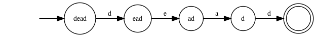
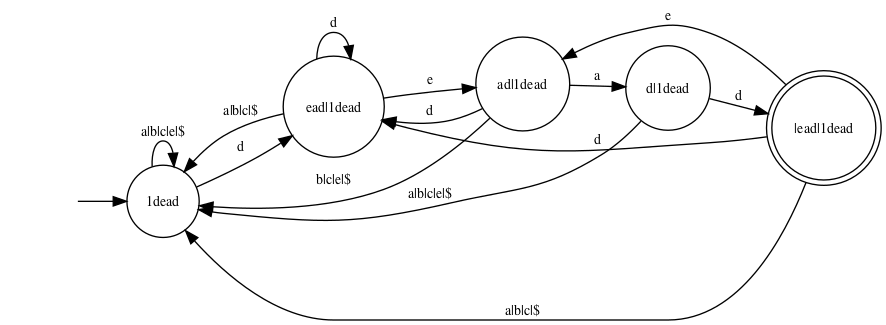
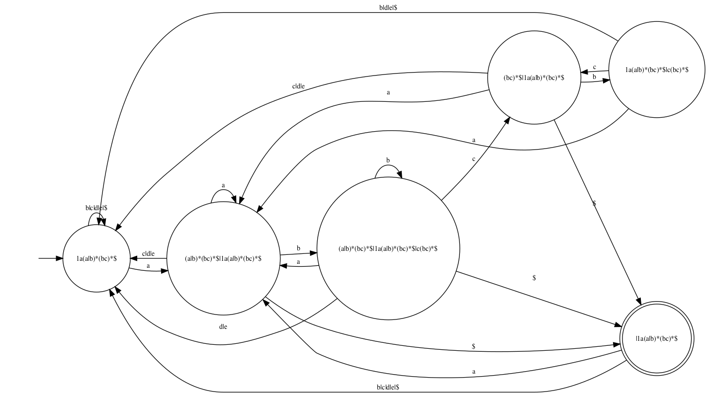
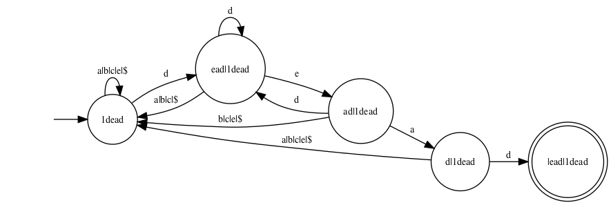
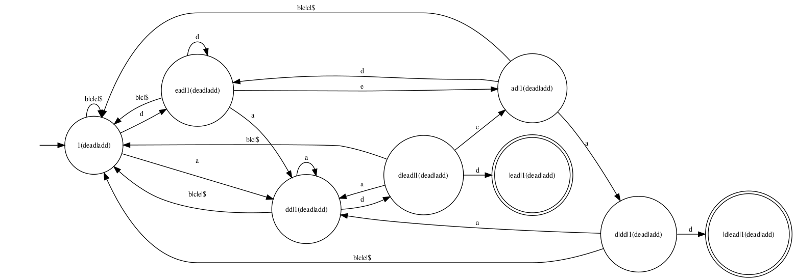

# Fixin' your automata

There are several ways of compiling
a [regular expression](https://en.wikipedia.org/wiki/Regular_expression) (RE)
down to a
[deterministic finite-state automaton](https://en.wikipedia.org/wiki/Deterministic_finite_automaton) (DFA).
One such way is based on
[Brzozowski derivatives](https://en.wikipedia.org/wiki/Brzozowski_derivative)
of regular expressions.
In this post,
I describe a concise OCaml implementation of this transformation.
This is an opportunity to illustrate the use of
[fix](https://gitlab.inria.fr/fpottier/fix/),
a library that offers facilities for
constructing (recursive) memoized functions
and for performing least fixed point computations.

<!------------------------------------------------------------------------------>

## From REs to DFAs, via Brzozowski derivatives

Suppose `e` denotes a set of words. Then, its **derivative** `delta a e` is
the set of words obtained by keeping only the words that begin with `a` and by
crossing out, in each such word, the initial letter `a`. For instance, the
derivative of the set `{ ace, amid, bar }` with respect to `a` is the set `{
ce, mid }`.

A regular expression is a syntactic description of a set of words. If the set
`e` is described by a regular expression, then its derivative `delta a e` is
also described by a regular expression, which can be effectively computed.

Now, suppose that I am a machine and I am scanning a text, searching for a
certain pattern. At each point in time, my current **state** of mind is
described by a regular expression `e`: this expression represents the set of
words that I am hoping to read, and that I am willing to accept. After I read
one character, say `a`, my current state **changes** to `delta a e`, because I
have restricted my attention to the words of `e` that begin with `a`, and I am
now hoping to recognize the remainder of such a word.

Thus, the idea, in a nutshell, is to **build a deterministic automaton whose
states are regular expressions and whose transition function is `delta`**.

The main nontrivial aspect of this apparently simple-minded approach is the
fact that **only a finite number of states arise** when one starts with a
regular expression `e` and explores its descendants through `delta`. In other
words, a regular expression `e` only has a finite number of iterated
derivatives, up to a certain equational theory. Thanks to this property, which
I won't prove here, the construction terminates, and yields a **finite-state**
automaton.
<!-- Cuius rei demonstrationem mirabilem sane detexi hanc marginis exiguitas -->
<!-- non caperet. -->

For more details, please consult the paper
[Regular-expression derivatives re-examined](https://www.cs.kent.ac.uk/people/staff/sao/documents/jfp09.pdf)
by Scott Owens, John Reppy and Aaron Turon.
In particular, Definition 4.1 in that paper
gives a number of equations that must be exploited
when deciding whether two regular expressions are equal.
In the following,
I refer to these equations collectively as **EQTH**,
for *equational theory*.
Among other things, these equations state that disjunction
is associative, commutative, and idempotent.
In other words, a disjunction must be viewed as a set of disjuncts.
The empty regular expression can be viewed as an empty disjunction.

<!------------------------------------------------------------------------------>

## An alphabet

Throughout, I assume that the alphabet is given by a module `Char` whose
signature is as follows:

```
Char : sig
  type t
  val equal: t -> t -> bool
  val hash: t -> int
  val foreach: (t -> unit) -> unit
  val print: t -> string
end
```

The fact that this alphabet is finite is witnessed by the existence of
the function `Char.foreach`, which enumerates all characters.

As an exercise for the reader, this can be used to define an auxiliary
function `exists_char` of type `(Char.t -> bool) -> bool`.

<!------------------------------------------------------------------------------>

## Regular expressions, hash-consed

The syntax of regular expressions (expressions, for short) is naturally
described by an algebraic data type `regexp`.

It is the same syntax as in
[Owens et al.'s paper](https://www.cs.kent.ac.uk/people/staff/sao/documents/jfp09.pdf),
except I use n-ary disjunctions and conjunctions. As explained above, this is
dictated by the need to take EQTH into account. The data constructors `EDisj`
and `EConj` carry a list of subexpressions. This list is normalized in such a
way that, if two lists are equal as sets, then they are equal as lists, too.
This list is never a singleton list. It can be empty: `EDisj []` is the empty
expression `zero`, while `EConj []` is the universal expression `one`.

```
type regexp =
  skeleton HashCons.cell

and skeleton =
  | EEpsilon
  | EChar of Char.t
  | ECat of regexp * regexp
  | EStar of regexp
  | EDisj of regexp list
  | EConj of regexp list
  | ENeg of regexp
```

A slight twist is that expressions are
[**hash-consed**](https://en.wikipedia.org/wiki/Hash_consing). That is, every
expression is decorated with an integer identifier. (A record of type
`skeleton HashCons.cell` is a pair of an integer identifier and a skeleton.)
These identifiers are unique: two expressions are equal if and only if they
carry the same identifier. (This notion of equality takes EQTH into account.)
This allows testing very quickly whether two expressions are equal. This also
allows building efficient dictionaries whose keys are expressions, or in
other words, efficient memoized functions of type `regexp -> ...`. This is
heavily exploited in the code that follows: the functions `nullable`, `delta`,
and `nonempty` are three examples, and there are more.
<!-- `N.encode`, inside `dfa`, is another example. -->

The module
[HashCons](https://gitlab.inria.fr/fpottier/fix/blob/master/src/HashCons.mli),
which is part of
[fix](https://gitlab.inria.fr/fpottier/fix/),
provides facilities for hash-consing.
(The reader is encouraged to take a look at
[its implementation:](https://gitlab.inria.fr/fpottier/fix/blob/master/src/HashCons.ml)
it is very short.)
It is used as follows:

```
let make : skeleton -> regexp =
  let module H = HashCons.ForHashedType(struct
    (* Define equality and hashing of skeletons. *)
    type t = skeleton
    let equal = ...
    let hash = ...
  end)
  in H.make

let skeleton : regexp -> skeleton =
  HashCons.data
```

The function `make` is where the magic takes place: whenever one wishes to
construct a new expression, one constructs just a skeleton and passes it to
`make`, which takes care of determining whether this skeleton is already
known (in which case an existing integer identity is re-used) or is new
(in which case a fresh integer identity is allocated).
The function `skeleton`, which converts between an expression and a
skeleton in the reverse direction, is just a pair projection.

Here are two basic examples of the use of `make`:

```
let epsilon : regexp =
  make EEpsilon
let zero : regexp =
  make (EDisj [])
```

Still using `make`, one can define several *smart constructors* that build
expressions: concatenation `@@`, disjunction, conjunction, iteration,
negation. These smart constructors reduce expressions to a normal form with
respect to the equational theory EQTH. In particular, `disjunction` flattens
nested disjunctions, sorts the disjuncts, and removes duplicate disjuncts, so
that two disjunctions that are equal according to EQTH are indeed recognized
as equal.

```
let (@@) : regexp -> regexp -> regexp = ...
let star : regexp -> regexp = ...
let disjunction : regexp list -> regexp = ...
let conjunction : regexp list -> regexp = ...
let neg : regexp -> regexp = ...
```

<!------------------------------------------------------------------------------>

## Nullability

An expression is nullable if and only if it accepts the empty word.
Determining whether an expression is nullable is a simple matter of
writing a recursive function `nullable` of type `regexp -> bool`.

I memoize this function, so the nullability of an expression is computed at
most once and can be retrieved immediately if requested again. (This is not
mandatory, but it is convenient to be able to call `nullable` without worrying
about its cost. Another approach, by the way, would be to store nullability
information inside each expression.)

The module
[Memoize](https://gitlab.inria.fr/fpottier/fix/blob/master/src/Memoize.mli),
which is part of
[fix](https://gitlab.inria.fr/fpottier/fix/),
provides facilities for memoization.
To use it, I apply the functor `Memoize.ForHashedType`
to a little module `R` (not shown) which equips the type `regexp` with
equality, comparison, and hashing functions. (Because expressions
carry unique integer identifiers, the definition of `R` is trivial.)
This functor application yields a module `M` which offers
a memoizing fixed-point combinator `M.fix`.

Then, instead of defining `nullable` directly as a recursive function,
I define it as an application of `M.fix`, as follows.

```
let nullable : regexp -> bool =
  let module M = Memoize.ForHashedType(R) in
  M.fix (fun nullable e ->
    match skeleton e with
    | EChar _ ->
        false
    | EEpsilon
    | EStar _ ->
        true
    | ECat (e1, e2) ->
        nullable e1 && nullable e2
    | EDisj es ->
        exists nullable es
    | EConj es ->
        forall nullable es
    | ENeg e ->
        not (nullable e)
  )
```

<!------------------------------------------------------------------------------>

## Derivation

It is now time to define a key operation: computing the Brzozowski derivative
of an expression. If `a` is a character and `e` is an expression, then `delta
a e` is the derivative of `e` with respect to `a`.

Implementing `delta` is a textbook exercise. A key remark, though, is that
this function **must** be memoized in order to ensure good complexity. A
naive, non-memoizing version of it would have exponential cost, due to the
duplication that takes place in the cases of concatenation and iteration.

In order to memoize a function of two arguments, one possible approach would
be to rewrite it as a function that takes a pair as an argument. Here,
instead, I rely on currying. For every character `a`, `delta a` is a function
of type `regexp -> regexp`. I memoize each such function independently using
`fix`, and I memoize the function `delta` itself using `memoize`, a
nonrecursive memoization combinator.

```
let delta : Char.t -> regexp -> regexp =
  let module C = Memoize.ForHashedType(Char) in
  let module M = Memoize.ForHashedType(R) in
  C.memoize (fun a ->
    M.fix (fun delta e ->
      match skeleton e with
      | EEpsilon ->
          zero
      | EChar b ->
          if Char.equal a b then epsilon else zero
      | ECat (e1, e2) ->
          delta e1 @@ e2 ||| if nullable e1 then delta e2 else zero
      | EStar e ->
          delta e @@ star e
      | EDisj es ->
          disjunction (map delta es)
      | EConj es ->
          conjunction (map delta es)
      | ENeg e ->
          neg (delta e)
    )
  )
```

<!------------------------------------------------------------------------------>

## (Non)Emptiness

During the construction of the DFA (which comes up next), it is convenient to
be able to (efficiently) decide whether an expression is nonempty (that is,
whether it accepts at least one word).

Following
[Owens et al.](https://www.cs.kent.ac.uk/people/staff/sao/documents/jfp09.pdf),
I have included all three Boolean operators (disjunction, conjunction,
negation) in the syntax of expressions. The presence of conjunction makes it
apparently nontrivial to determine whether an expression is nonempty.

Fortunately, by exploiting `nullable`, `delta`, and with the help of
[fix](https://gitlab.inria.fr/fpottier/fix/), I am able to define
an efficient nonemptiness test in four lines of code:

```
let nonempty : regexp -> bool =
  let module F = Fix.ForHashedType(R)(Prop.Boolean) in
  F.lfp (fun e nonempty ->
    nullable e || exists_char (fun a -> nonempty (delta a e))
  )
```

This test is based on the following fact: `e` is nonempty if and only if
either `e` is nullable or there exists a character `a` such that `delta a e`
is nonempty.

This statement, however, cannot be used directly as a recursive definition of
`nonempty`, because such a definition would not be well-founded. An attempt to
define `nonempty` using `let rec` or `M.fix` would construct a possibly
nonterminating function.

Instead, the above statement must be viewed as **an inductive
characterization** of nonemptiness. That is, `nonempty` is the **least fixed
point** in the Boolean lattice (where `false` is less than `true`) of the
equation:

```
nonempty e = nullable e || exists_char (fun a -> nonempty (delta a e))
```

The main module of the
[fix](https://gitlab.inria.fr/fpottier/fix/)
library, named
[Fix](https://gitlab.inria.fr/fpottier/fix/blob/master/src/Core.mli),
is an algorithm for computing a least fixed point of type
`variable -> property`,
where the type `property` forms a lattice.
The functor application `Fix.ForHashedType(R)(Prop.Boolean)`
instantiates this algorithm so that the type `variable` is `regexp`
and the type `property` is `bool`.
Then, the fixed point combinator `F.lfp` allows us to give a
straightforward definition of `nonempty`.

The function `nonempty` thus defined is incremental. Nothing is computed when
the function is constructed; computation takes place only when the function is
invoked. It is also memoized: the nonemptiness of an expression, once
computed, is recorded and is never recomputed. Thus, one can invoke this
function without worrying about its cost.

The reader might note that nonemptiness could also be computed via a graph
traversal: an expression is nonempty if only there is exists a path from this
expression to a nullable expression in the graph whose vertices are
expressions and whose edges are determined by `delta`. What I have just done
is exploit the fact that co-accessibility is easily expressed as a least fixed
point.

<!-- Accessibility, too, can be expressed as a least fixed point. However, -->
<!-- this requires access to the predecessors of each vertex. -->

<!------------------------------------------------------------------------------>

## Constructing a DFA

The tools are now at hand to convert an expression
to a deterministic finite-state automaton.

I must first settle on a representation of such an automaton as a data
structure in memory. I choose to represent a state as an integer in the range
of `0` to `n-1`, where `n` is the number of states. An automaton can then
be described as follows:

```
type state =
  int

type dfa = {
  n: int;
  init: state option;
  decode: state -> regexp;
  transition: state -> Char.t -> state option;
}
```

`init` is the initial state. If it is absent, then the automaton rejects every
input.

The function `decode` maps every state to the expression that this state
accepts. This expression is guaranteed to be nonempty. This state is a final
state if and only if this expression is nullable.

The function `transition` maps every state and character to an optional target
state.

Now, how does one construct a DFA for an expression `e`?
The answer is simple, really.
Consider the infinite graph whose vertices are the
nonempty expressions and whose edges are determined by `delta`.
The fragment of this graph that is reachable from `e`
is guaranteed to be finite,
and is exactly the desired automaton.

<!-- Can we point to a proof of finiteness? -->

There are several ways of approaching the construction of this finite graph
fragment. I choose to first perform a forward graph traversal during which I
discover the vertices that are reachable from `e` and number them from `0` to
`n-1`. Once this is done, completing the construction of a data structure of
type `dfa` is easy.

```
let dfa (e : regexp) : dfa =
  let module G = struct
    type t = regexp
    let foreach_successor e yield =
      Char.foreach (fun a ->
        let e' = delta a e in
        if nonempty e' then yield e'
      )
    let foreach_root yield =
      if nonempty e then yield e
  end in
  let module N = Number.ForHashedType(R)(G) in
  let n, decode = N.n, N.decode in
  let encode e = if nonempty e then Some (N.encode e) else None in
  let init = encode e in
  let transition q a = encode (delta a (decode q)) in
  { n; init; decode; transition }
```

In the above code, the module `G` is
a description of the graph that I wish to traverse.

The module
[Number](https://gitlab.inria.fr/fpottier/fix/blob/master/src/Number.mli),
which is part of [fix](https://gitlab.inria.fr/fpottier/fix/),
helps explore this graph.
The functor application `Number.ForHashedType(R)(G)` performs a traversal of
the graph `G` and constructs a numbering `N` of its vertices.
The module `N` contains the following data:

```
  val n: int
  val encode: regexp -> int
  val decode: int -> regexp
```

Here, `n` is the number of vertices that have been discovered. The functions
`encode` and `decode` record the correspondence between vertices and numbers.
In other words, `decode` has type `state -> regexp` and maps a state to the
nonempty expression that this state stands for. Conversely, `encode` has type
`regexp -> state` and maps a nonempty expression to a state.

I extend `encode` to a function of type `regexp -> state option`, which can be
applied to a possibly empty expression. Once this is done, the initial state
`init` is obtained by transporting the expression `e` through the encoding,
while the transition function `transition` is obtained by transporting the
function `delta` through the encoding.

That's all!

The automaton thus obtained is not necessarily minimal.

<!------------------------------------------------------------------------------>

## Examples

The expression `dead` gives rise, quite naturally, to the following automaton.
As usual, every transition is labelled with a character. In addition, every
state is labelled with the expression that it represents.



Naturally, this automaton is not very useful, as it merely tests whether the
input **begins** with `dead`. To **search** the input for the word `dead`, one
should use the expression `1dead`. (Here, `1` denotes the universal expression
`one`.) This expression gives rise to the following automaton:



Here is another example of searching for a nontrivial pattern. This automaton
corresponds to the expression `1a(a|b)*(bc)*`:



The reader may notice that a final state can have outgoing transitions. If one
is interested in finding all matches or in finding a longest match, then this
is useful.

However, if one is interested only in searching for a first match and a
shortest match, then there is no need for a final state to have outgoing
transitions. The above construction can easily be modified so that final
states do not carry any outgoing transitions. This leads to slightly simpler
automata. For instance, the expression `1dead` leads to the following
first-match automaton:



Feeding an input text into this automaton is essentially equivalent to
searching for the word `dead` using the Knuth-Morris-Pratt algorithm.

The expression `1(add|dead)`, which is used to search a text for one of the
words `add` and `dead`, gives rise to the following first-match
automaton:



Feeding an input text into this automaton is essentially equivalent to
searching for one of the words `add` and `dead` using Aho and Corasick's
algorithm.

<!--
Further reading:
https://dl.acm.org/citation.cfm?id=321249
Directly Constructing Minimal DFAs: Combining Two Algorithms by Brzozowski
-->

<!------------------------------------------------------------------------------>

## Conclusion

Memoization, hash-consing, and fixed points are powerful tools. The
[fix](https://gitlab.inria.fr/fpottier/fix/) library makes these tools easy
to use. The conversion of regular expressions to deterministic finite-state
automata by Brzozowski's method is a good illustration of their application.

For more details,
please look at the
[full source code for this demo](https://gitlab.inria.fr/fpottier/fix/blob/master/demos/brz/).

As a bonus, Gabriel Radanne contributed a
[stress test](https://gitlab.inria.fr/fpottier/fix/blob/master/demos/brz/TestGen.ml)
based on [regenerate](https://github.com/regex-generate/regenerate).
